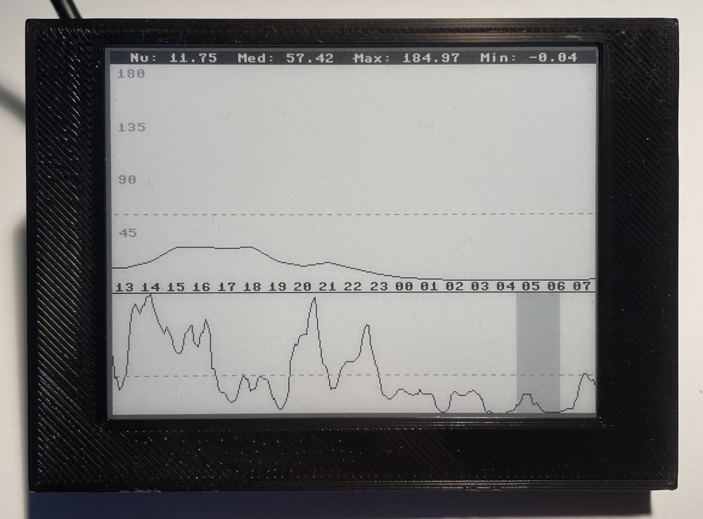

# microchart

<p align="center">
  
  
</p>

## Hardware
- RPI Pico W
- Waveshare 400x300 E-Ink display module

## Software
### Setup
Create the file `./src/secrets.py` containing the following constants:

``` python
# secrets.py

API_URL: str = ?
SSID: str = ?
PASSWORD: str = ?
```
### Deploy
1. Install micropython
2. Upload all files in `./src`.

## 3D models

Models for 3d printing are located in `./3d`.
